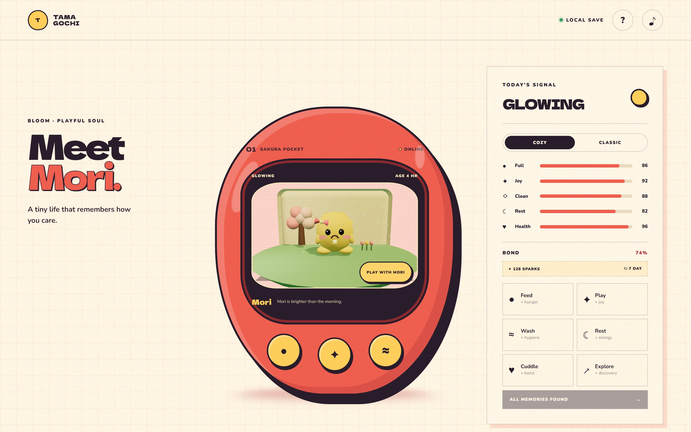
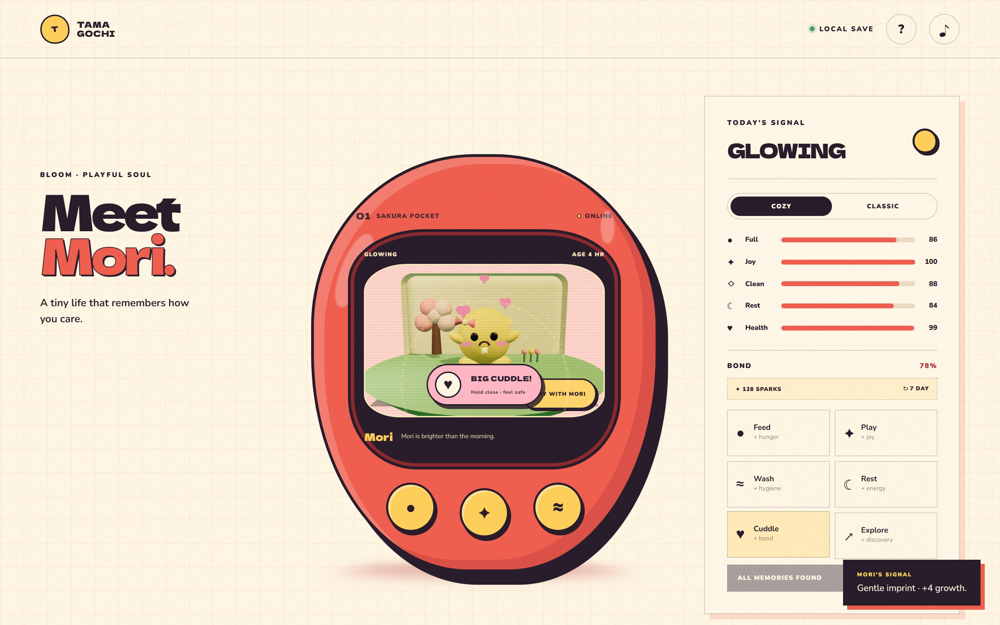
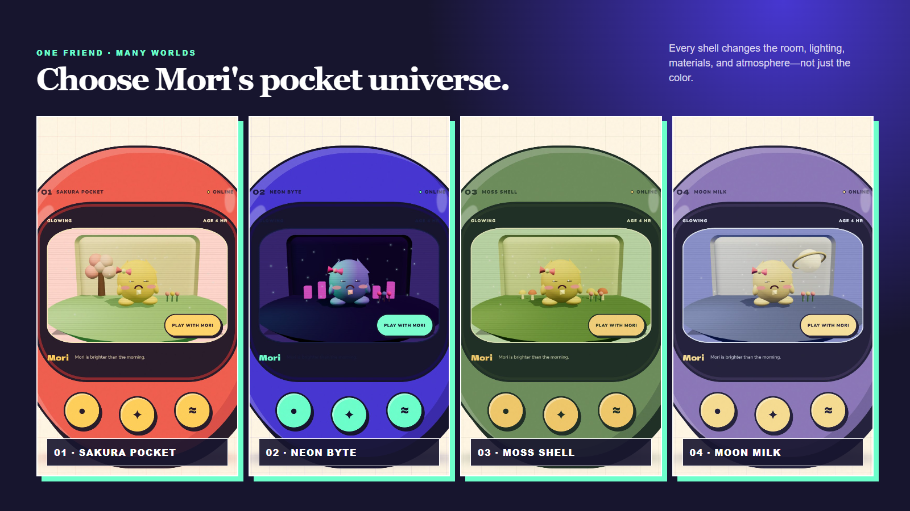
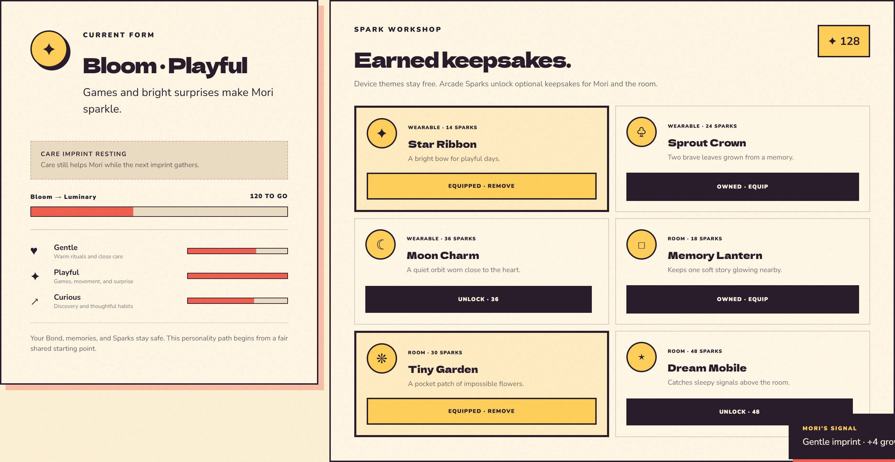
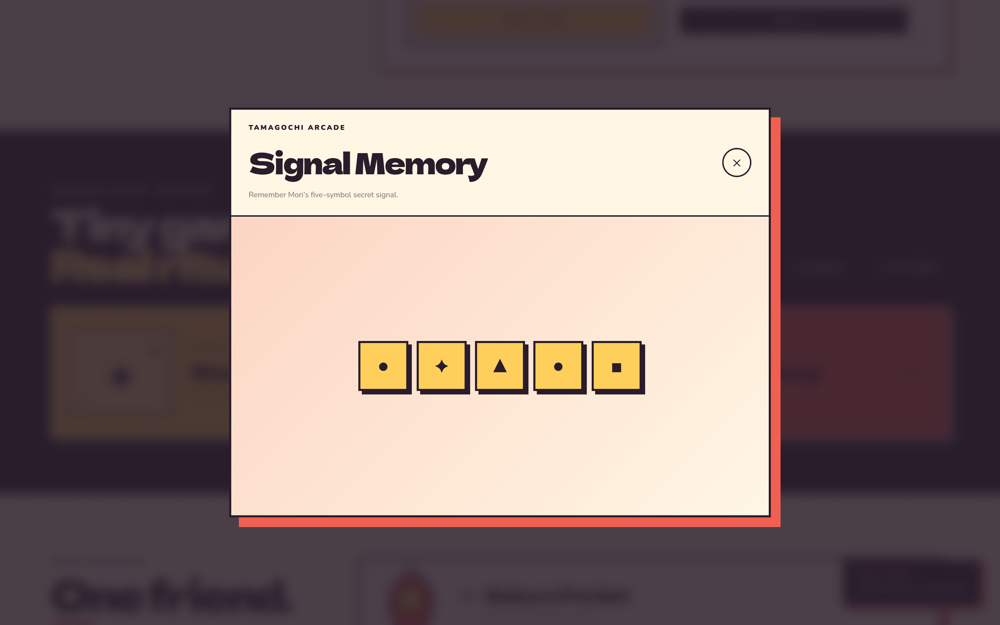

<div align="center">


# Tamagochi

### A tiny life that remembers how you care.

Look after Mori, play a few pocket-sized games, and watch the world change around your habits.

[Quick start](#getting-started) · [Gameplay](#gameplay) · [Architecture](#architecture) · [Contribute](#contributing)

</div>



> [!IMPORTANT]
> Tamagochi is an original project inspired by virtual-pet games. It does not use Tamagotchi characters, artwork, music, or other protected assets.

## About the game

Tamagochi is a small browser game about caring for Mori, an original low-poly companion. Mori has five needs and six care actions. Over time, the way you play affects bond, stories, personality, incidents, and growth.

The whole game runs in the browser. It saves to the current device, works offline once installed, and does not need an account or backend. There are no ads, analytics, or paid items.

## What you can do

- Feed, play with, wash, rest, cuddle, and explore with Mori.
- Choose Cozy mode for relaxed play or Classic mode for stronger time pressure.
- Grow from Seedling to Bloom and Luminary while shaping a Gentle, Playful, or Curious personality.
- Play Star Catch and Signal Memory to earn Sparks.
- Spend Sparks on cosmetic wearables and room keepsakes.
- Switch between Sakura, Neon, Moss, and Moon pocket worlds.
- Install the game as a PWA and keep playing offline.

## Screenshots

<table>
  <tr>
    <td width="50%"></td>
    <td width="50%"></td>
  </tr>
  <tr>
    <td align="center"><strong>Caring for Mori</strong></td>
    <td align="center"><strong>Four pocket worlds</strong></td>
  </tr>
  <tr>
    <td></td>
    <td></td>
  </tr>
  <tr>
    <td align="center"><strong>Growth and keepsakes</strong></td>
    <td align="center"><strong>Signal Memory</strong></td>
  </tr>
</table>

## Help build it

Contributions are welcome. The clearest places to help next are save import and export, simulation tests, mobile graphics settings, new incidents and stories, translations, and additional Arcade games. Please open an issue before starting a large change so the idea can be discussed first.

> [!WARNING]
> The source is public, but the repository is not legally open source until it has a license file. Choose an OSI-approved license before announcing it as an open-source project.

## Contents

- [Gameplay](#gameplay)
- [Tech stack](#tech-stack)
- [Getting started](#getting-started)
- [Available commands](#available-commands)
- [PWA installation](#pwa-installation)
- [Architecture](#architecture)
- [Save data, offline play, and privacy](#save-data-offline-play-and-privacy)
- [Deployment](#deployment)
- [Contributing](#contributing)
- [Original-content policy](#original-content-policy)
- [Troubleshooting](#troubleshooting)
- [Roadmap and contribution ideas](#roadmap-and-contribution-ideas)
- [License status](#license-status)

## Gameplay

### Care for Mori

Mori tracks five needs: hunger, joy, hygiene, energy, and health. The care panel exposes six actions with different trade-offs:

| Action | Primary purpose | Other effects |
| --- | --- | --- |
| Feed | Restores hunger | Slight health gain; can reduce hygiene |
| Play | Restores joy | Costs energy and a little hunger |
| Wash | Restores hygiene | Adds a little joy |
| Rest | Restores energy | Adds health; costs hunger |
| Cuddle | Builds joy and bond | Adds health and a little energy |
| Explore | Adds joy and discovery | Costs energy, hunger, and hygiene |

Every action has a distinct visible animation. Cuddle, for example, crosses Mori's arms inward, closes the eyes, leans into the pose, and releases hearts.

### Choose a care mode

- **Cozy:** slower decay, a 12-hour offline-decay cap, minimum need floors, and no health penalty from unresolved incidents.
- **Classic:** full decay and gradual, capped incident health pressure until Mori receives the matching care action.

Modes can be changed at any time. Timed state is settled before the new mode takes effect.

### Shape Living Evolution

Growth points move Mori through three forms:

1. **Seedling** — the starting form.
2. **Bloom** — unlocked at 120 growth.
3. **Luminary** — unlocked at 320 growth.

Care, story choices, incidents, and the Arcade shape Gentle, Playful, and Curious scores. Care-based growth is cooldown-gated, and Arcade growth is limited to once per UTC day, so normal play is rewarded without encouraging repetitive farming.

### Resolve Pocket Incidents

An incident can appear while time advances. It remains visible until the matching action is used:

- **A Static Cloud** → Cuddle
- **The Tangled Sprout** → Wash
- **A Wandering Signal** → Explore

The Growth Studio explains the active incident, and the relevant care button receives a visible and accessible rescue state. Resolving an incident awards Sparks and growth.

### Earn and spend Sparks

Star Catch and Signal Memory award Sparks based on performance and track local best scores. The Spark Workshop contains cosmetic rewards only:

- Wearables: Star Ribbon, Sprout Crown, Moon Charm
- Room keepsakes: Memory Lantern, Tiny Garden, Dream Mobile

Device themes remain free. Workshop items provide no gameplay advantage.

## Tech stack

| Area | Technology |
| --- | --- |
| Language | TypeScript 6 |
| UI | React 19 |
| State and persistence | Zustand 5 |
| 3D rendering | Three.js, React Three Fiber, Drei |
| Styling | Layered CSS with responsive and reduced-motion rules |
| Audio | Original procedural Web Audio chiptune and sound effects |
| Tooling | Vite 8, ESLint 10 |
| Offline/PWA | vite-plugin-pwa / Workbox |
| Deployment configuration | Vercel |

All dependency versions are pinned in `package.json` and `package-lock.json`.

## Getting started

### Prerequisites

- [Node.js](https://nodejs.org/) **22.x**
- npm, included with Node.js
- A modern browser with JavaScript enabled
- WebGL for the full 3D scene; a safe fallback is shown when WebGL is unavailable

No environment variables, database, account, or external service credentials are required.

### 1. Clone the repository

```bash
git clone https://github.com/Tech-aficionado/Tamagochi---Open-Source-Game.git
cd Tamagochi---Open-Source-Game
```

### 2. Install exact dependencies

```bash
npm ci
```

Use `npm install` only when intentionally updating dependencies and the lockfile.

### 3. Start local development

```bash
npm run dev
```

Vite prints the local URL, normally `http://localhost:5173`. The development server is not an offline-production test; use a production build and preview for that.

### 4. Validate a change

```bash
npm run lint
npm run build
npm audit --audit-level=high
```

### 5. Preview the production build

```bash
npm run preview
```

The generated site is written to `dist/`. That directory is intentionally ignored and must not be committed.

## Available commands

| Command | Purpose |
| --- | --- |
| `npm run dev` | Start the Vite development server |
| `npm run lint` | Run ESLint across the repository |
| `npm run build` | Type-check and create the production/PWA bundle |
| `npm run preview` | Serve the generated production build locally |
| `npm audit --audit-level=high` | Check installed packages for high-severity vulnerabilities |

There is currently no permanent automated test suite. Do not document or assume a test command that is not present in `package.json`; validate with lint, build, targeted browser checks, and focused deterministic probes when changing simulation rules.

## PWA installation

Tamagochi can be installed from a secure production deployment or a supported local secure context.

### Android and desktop Chromium browsers

1. Open Tamagochi in Chrome, Edge, or another compatible browser.
2. Use **Install App** when Tamagochi displays it, or use the browser's install option.
3. Confirm installation. The app opens in standalone mode and remains available offline after its assets are cached.

### iPhone and iPad

1. Open Tamagochi in Safari.
2. Tap **Share**.
3. Choose **Add to Home Screen**.
4. Tap **Add**.

The in-game install control opens these iOS instructions when automatic install prompts are unavailable.

> Offline support caches the application shell. Save data is still browser-local, so clearing site data or uninstalling may remove Mori's progress.

## Architecture

Tamagochi separates deterministic game state from React UI and Three.js presentation:

```text
User input
   │
   ▼
React UI ───────────────► Zustand actions
   │                           │
   │                           ├── settle elapsed time
   │                           ├── apply care/story/activity rules
   │                           ├── resolve incidents and purchases
   │                           └── persist normalized snapshot
   │
   └──────── snapshot ──► React Three Fiber scene
                              ├── Mori pose and expression
                              ├── evolution/personality marks
                              ├── equipped cosmetics
                              └── themed room and effects
```

### Project structure

```text
.
├── public/                     # PWA icons and offline fallback
├── docs/
│   ├── DESIGN.md               # Product and technical decisions
│   └── plans/                  # Implementation plans
├── src/
│   ├── audio/chiptune.ts       # Procedural music and action SFX
│   ├── data/themes.ts          # Four data-driven device worlds
│   ├── game/
│   │   ├── progression.ts      # Pure progression, incident, and catalog rules
│   │   ├── save.ts             # Fresh-state creation and save normalization
│   │   ├── store.ts            # Zustand simulation actions and persistence
│   │   └── types.ts            # Shared game-domain types and mood rules
│   ├── scene/PetScene.tsx      # Low-poly 3D world and action animation
│   ├── ui/
│   │   ├── ActivityArcade.tsx  # Star Catch and Signal Memory
│   │   ├── FirstRunTutorial.tsx# Persistent four-step onboarding
│   │   └── GrowthStudio.tsx    # Evolution, incidents, and workshop UI
│   ├── App.tsx                 # Main accessible application composition
│   ├── main.tsx                # React entry point
│   └── styles.css              # Visual system and responsive behavior
├── vite.config.ts              # Vite and PWA configuration
└── vercel.json                 # Vercel build/output settings
```

### Important design boundaries

- `progression.ts` contains pure, typed balancing rules rather than UI logic.
- `save.ts` treats persisted browser data as untrusted and normalizes it field by field.
- `store.ts` settles elapsed time once before timed actions and performs game transitions atomically.
- `PetScene.tsx` renders the snapshot but does not own game truth.
- React provides semantic controls and readable status independently of the 3D presentation.
- New visual content should remain bounded and low-poly to protect mobile performance.

See [`docs/DESIGN.md`](docs/DESIGN.md) and the [Living Progression plan](docs/plans/2026-07-16-living-progression.md) for rationale and balancing constraints.

## Save data, offline play, and privacy

- Saves use browser storage under the compatibility key `pocket-worlds-save-v1`.
- The current schema is version 3 and safely normalizes malformed, stale, or legacy values.
- The older tutorial completion key remains supported so returning players are not forced through onboarding again.
- Offline need decay is computed from timestamps when the game resumes.
- Saves are local to a browser profile and are not synchronized across devices or tabs.
- Tamagochi has no backend, login, analytics, advertising SDK, or telemetry.
- Editing the local clock or save data can affect progression; this is accepted for an offline solo game.

To start over, use **Reset Save** in the footer and confirm the prompt. To remove all local state manually, clear the site's storage in browser settings.

## Deployment

The repository includes `vercel.json` with the Vite framework preset, `npm run build`, and `dist` output.

### Deploy with Vercel

1. Import the GitHub repository into Vercel.
2. Keep the detected framework as **Vite**.
3. Use the repository settings:
   - Build command: `npm run build`
   - Output directory: `dist`
4. Deploy.

No environment variables are required. Use HTTPS in production so service workers and installation features are available.

You can also deploy the contents of `dist/` to any static host that supports HTTPS. Preserve generated PWA files and serve `index.html` for the application entry point.

## Contributing

Contributions are welcome, especially focused changes that preserve the game's original identity and local-first design.

### Contribution workflow

1. Fork the repository.
2. Create a focused branch:

   ```bash
   git switch -c feat/short-description
   ```

3. Install and validate locally:

   ```bash
   npm ci
   npm run lint
   npm run build
   ```

4. Commit one logical change at a time using a conventional message, for example:

   ```bash
   git commit -m "feat(game): Add a new pocket incident"
   ```

5. Push your branch and open a pull request against `main`.

### Pull request expectations

- Explain what changed, why it belongs in Tamagochi, and how it was checked.
- Keep simulation behavior deterministic and persistence backward-compatible.
- Preserve the storage key `pocket-worlds-save-v1` unless a documented migration requires otherwise.
- Do not break the six distinct care animations; Cuddle must continue to read visibly as cuddling.
- Include accessible text/status for information conveyed in 3D or through color.
- Check desktop and mobile layouts and `prefers-reduced-motion` behavior.
- Avoid unrelated formatting, generated output, editor settings, and temporary probe files.
- Never commit `node_modules/`, `dist/`, `.vscode/`, `.env*`, or files inside `.git/`.

## Original-content policy

Contributions must be original or used under terms compatible with the repository's eventual license. Do not submit:

- Tamagotchi characters, device art, logos, copied UI, or story content
- Ripped or imitated commercial game music and sound effects
- Assets without clear provenance and reuse permission
- Trademarked branding that suggests official affiliation

New creatures, stories, sounds, themes, and cosmetics should extend Tamagochi's own pocket-world retro-futurist direction. When contributing third-party assets, document the source, author, and applicable terms in the pull request.

## Troubleshooting

### `npm ci` reports an unsupported Node version

Use Node.js 22.x, as required by `package.json`. Confirm with:

```bash
node --version
npm --version
```

### The 3D pet is missing

- Confirm hardware acceleration and WebGL are enabled.
- Update the browser and graphics driver.
- Disable extensions that block canvas or WebGL content.
- Check the browser console for a rendering error.

Tamagochi should show a text fallback when WebGL is unavailable; Mori's saved state remains safe.

### Music does not start automatically

Browsers block audio before user interaction. Press the music button once to create/resume the Web Audio context. Tamagochi intentionally does not autoplay sound.

### The install button is not visible

- Confirm the app is served over HTTPS or from a supported local development origin.
- The button is hidden when the app is already running in standalone mode.
- On iOS, open the site in Safari and use Share → Add to Home Screen.
- A browser may delay its install event until PWA eligibility criteria are met.

### Offline mode does not work during development

Service-worker behavior should be checked against a production build:

```bash
npm run build
npm run preview
```

Load the preview once while online, then use browser developer tools to test an offline reload.

### Progress looks different after clearing browser data

Saves are not cloud-backed. Clearing site storage, using private browsing, switching browser profiles, or uninstalling the PWA can remove local progress.

### A stale dependency or generated bundle causes problems

Recreate local dependencies and output:

```bash
npm ci
npm run build
```

Do not commit the regenerated `dist/` directory.

## Roadmap and contribution ideas

The existing game already includes saves, themes, activities, music, sound effects, cosmetics, progression, incidents, stories, and mobile PWA support. Good future contributions include:

- Additional original story chapters and incident variants
- More data-driven original creatures without replacing Mori's identity
- Import/export for local save backups
- Explicit cross-tab conflict handling
- Optional quality controls for lower-powered mobile GPUs
- Expanded keyboard and assistive-technology testing
- Focused simulation unit tests and browser-level smoke tests
- New original Arcade activities with bounded daily progression rewards
- Localization infrastructure and translated content
- A documented, community-approved project license

Before implementing a large feature, open an issue or discussion describing its player value, persistence impact, accessibility behavior, performance cost, and original-content plan.

## License status

**No software license file has been declared in this repository yet.** Public source code alone does not grant permission to copy, redistribute, or create derivative works. Until the maintainers add an explicit license, default copyright restrictions apply.

You may inspect the code and submit contributions through the repository workflow, but do not assume MIT or another open-source license. A future licensing contribution should add a real `LICENSE` file and update this section in the same change.

---

<div align="center">

Built as an original community virtual-pet project. Code, create, care.

</div>
